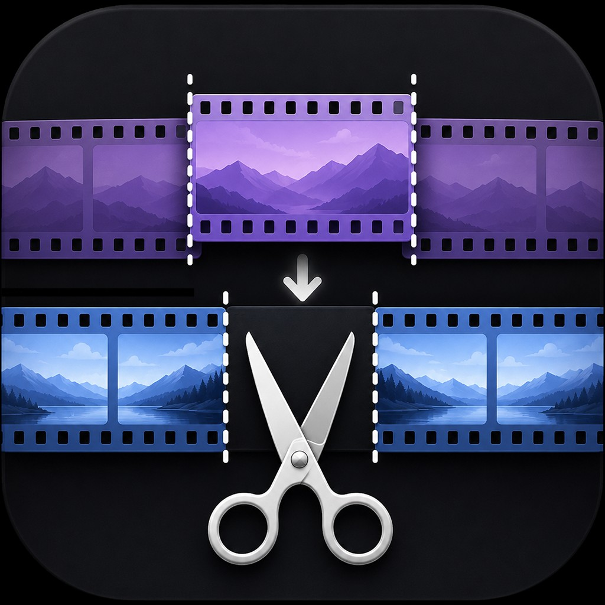

	 
  

  
<b style="font-size: 24px;">Tapeless VTR Editor</b>

  Fast insert editing tool for broadcast-grade video — replace frames losslessly without re-encoding.
	 
  
  
  
	 
	 
  
  

	 
	 

**Tapeless VTR Editor** is a specialized utility designed for professionals who need to perform precise "insert edits" on high-quality video files. Unlike traditional NLEs that require rendering or re-encoding the entire timeline, this tool allows you to replace specific frames or segments **losslessly**, maintaining the exact original quality and bitstream of the source.

It is ideal for broadcast environments where maintaining the integrity of the original codec (such as ProRes or DNxHD) is critical.

[https://github.com/rlatkddbs235/Tapeless-VTR-Editor/releases/tag/1.0.0](https://github.com/rlatkddbs235/Tapeless-VTR-Editor/releases/tag/1.0.0)

## ⚠️ Warning: Built with 100% Vibe Coding
This project was fully built using Vibe Coding with AI.

## 🛠 Features

- **True Lossless Insert Editing**: Replace frames or segments without re-encoding. No quality loss, no generation loss.
- **Frame-Accurate Precision**: Precisely target the frames that need replacement to ensure a seamless cut.
- **Broadcast-Grade Codec Support**: Optimized for professional formats used in television and cinema.
- **High-Speed Processing**: Powered by FFmpeg, performing direct data manipulation for near-instant results.
- **Intuitive GUI**: Simple, focused interface for selecting files, defining ranges, and executing replacements.
- **macOS Native**: Distributed as a standalone `.dmg` for easy installation on Mac.

## 📺 Supported Formats

The editor is built to handle heavy-duty professional codecs. Supported formats include, but are not limited to:

- **Apple ProRes** (422, 4444, etc.)
- **Avid DNxHD / DNxHR**
- **Sony XDCAM, XAVC(Intra Only)**
- **Other FFmpeg-compatible All-Intra formats**

## 🚀 Getting Started

### Installation
1. Download the latest `Tapeless-VTR-Editor-v1.0.0.dmg` from the [Releases](https://github.com/rlatkddbs235/Tapeless-VTR-Editor/releases/tag/1.0.0) section.
2. Open the `.dmg` file and drag **Tapeless VTR Editor** to your `Applications` folder.
3. Launch the app and start editing.
4. ### ⚠️ macOS Gatekeeper (Security Notice)
Since this app is not signed by a certified Apple Developer, macOS may block it from opening with a warning: *"App cannot be opened because it is from an unidentified developer."*

To bypass this and run the app, please use one of the following methods:

**Method : System Settings**
1. Try to open the app normally (it will show the warning). Click **OK**.
2. Go to **System Settings** $\rightarrow$ **Privacy & Security**.
3. Scroll down to the **Security** section.
4. You will see a message saying *"Tapeless VTR Editor was blocked..."*. Click the **Open Anyway** button.
5. Enter your Mac password and click **Open**.

### Basic Workflow
1. **Load Source**: Select the master video file you wish to edit.
2. **Define Range**: Identify the specific frames or timecode range that needs to be replaced.
3. **Insert New Content**: Select the replacement clip (must match the source codec/parameters for lossless operation).
4. **Execute**: Run the insert process to generate the final output file.

## ⚙️ Technical Requirements

- **OS**: macOS (Apple Silicon)
- **Backend**: FFmpeg (Bundled)
- **Language**: Python 3.11

- ⚠️ Notice for Windows / Intel Mac Users
Currently, pre-built binaries are only provided for Apple Silicon (ARM64) Macs. If you are using Windows or an Intel Mac, you can easily build the app from the source code using AI Agents (like Codex, Manus, Antigravity, or ChatGPT).
How to build via AI Agent:
Download the source code (Zip) or clone this repository.
Open your AI Agent and copy-paste the following prompt:
"I want to build this open-source project on my [Your OS: e.g., Windows 11 / Intel Mac]. Here is the source code directory. Please check the package.json (or CMakeLists.txt, requirements.txt etc...) and guide me step-by-step through the installation and build process."
---

Made for broadcast professionals who value precision and quality. 🎬
